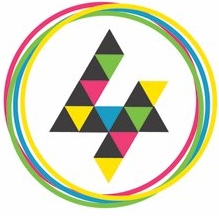

[![CC BY-SA 4.0][cc-by-sa-image]][cc-by-sa]

<!-- PROJECT LOGO -->
 

  
  <h3 align="center">D4G_Placeholders [![CC BY-SA 4.0][cc-by-sa-shield]][cc-by-sa]</h3>
  

    The Placeholders' (we couldn't find a team name) Design 4 Green 2020 project
     
  

<!-- ABOUT THE PROJECT -->
## About The Project

[![our app in action][product-screenshot]](146.59.196.47)

### Built With

* [Bootstrap](https://getbootstrap.com)
* [NodeJS](https://nodejs.org)
* [React](https://reactjs.org)
* [Material Design Icons](https://materialdesignicons.com)

<!-- USAGE EXAMPLES -->
## Usage

Simply enter a postcode (or select a region, department and township) to get information pertaining to your township's digital fragility status.

<!-- LICENSE -->
## License

Distributed under the [Creative Commons Attribution-ShareAlike 4.0 International License][cc-by-sa]. See `LICENSE` for more information.

<!-- Contributors -->
## Contributors

* [Kevin Voyer](https://github.com/kecsou) - React/Node Expertise
* [Daniel Sebton](https://github.com/Allexio) - Information parsing, readme and design
* [Doreen Daunique](https://github.com/DoreenDaunique) - Front-end, design
* [Institut du Numérique Responsable](https://institutnr.org/) - Data used to reply to user queries

[product-screenshot]: images/screenshot.png
[cc-by-sa]: http://creativecommons.org/licenses/by-sa/4.0/
[cc-by-sa-image]: https://licensebuttons.net/l/by-sa/4.0/88x31.png
[cc-by-sa-shield]: https://img.shields.io/badge/License-CC%20BY--SA%204.0-lightgrey.svg