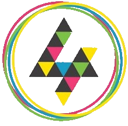

<!-- PROJECT LOGO -->
 

  
  <h3 align="center">D4G 2020 - The Placeholders </h3>
  

    The Placeholders' (we couldn't find a team name) Design 4 Green 2020 project
  

 

[![CC BY-SA 4.0][cc-by-sa-shield]][cc-by-sa]

## About The Project

[![our app in action][product-screenshot]](http://146.59.196.47/)

This is a web app that lets any user look up their French township to get information about the township's digital fragility level.
This indicator is calculated from data ranging from the age and digital knowhow of inhabitants, to the actual hardware coverage available in the region. More information about the criteria for this rating can be found [here](https://indice.institutnr.org/#indicateur).

As part of the Design 4 Green initiative, we have strived to reduce the amount of data moving between clients and the server, and only send the client the data that he strictly requires, nothing more, nothing less.

This project is an entry to the 2020 Design 4 Green 48H hackathon.

### Built With

* [NodeJS](https://nodejs.org)
* [React](https://reactjs.org)
* [Material UI](https://material-ui.com/)

## Usage

Simply go to [our website](http://146.59.196.47/), enter a postcode (or select a region, department and township) to get information pertaining to your township's digital fragility status.

## Sonarqube

http://vps-05d35bef.vps.ovh.net:9000/  

login: admin 
password: admin 

## Some metrics

use with : http://vps-05d35bef.vps.ovh.net

* [gtmetrix](https://gtmetrix.com/reports/146.59.196.47/JFYLo3r4)
* [ecoindex](http://www.ecoindex.fr/resultats/?id=100504)
* [ecograder](https://ecograder.com)

## Contributors

* [Kevin Voyer](https://github.com/kecsou) - React/Node Expertise, front end
* [Daniel Sebton](https://github.com/Allexio) - Front end, Information parsing, design
* [Doreen Daunique](https://github.com/DoreenDaunique) - Ops
  
* [Institut du Numérique Responsable](https://institutnr.org/) - Data used to reply to user queries

[product-screenshot]: res/app_in_action.png
[cc-by-sa]: http://creativecommons.org/licenses/by-sa/4.0/
[cc-by-sa-image]: https://licensebuttons.net/l/by-sa/4.0/88x31.png
[cc-by-sa-shield]: https://img.shields.io/badge/License-CC%20BY--SA%204.0-lightgrey.svg

## License

[![CC BY-SA 4.0][cc-by-sa-image]][cc-by-sa]

The source code of this challenge remains the property of the dedicated team of developers found in the contributors section.

Distributed under the [Creative Commons Attribution-ShareAlike 4.0 International License][cc-by-sa]. See `LICENSE` for more information.
